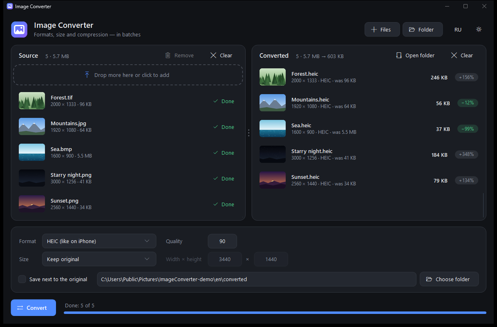
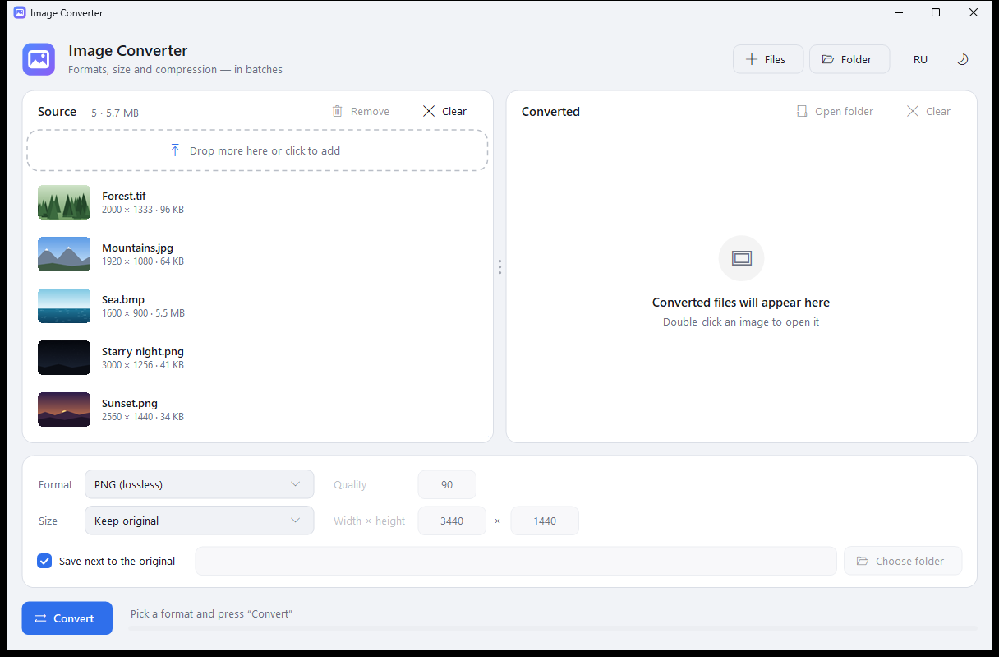

# Image Converter

**English** | [Русский](README.ru.md)

A small Windows app: drop images in and get them back in the format and size you need, in batches. Source files are on the left, converted ones on the right with their new size and how much it changed.



<details>
<summary>Light theme</summary>



</details>

## Features

- **Opens:** JPG, PNG, WebP, HEIC/HEIF, AVIF, JPEG XL, camera RAW (CR2, CR3, NEF, ARW, DNG and more), BMP, GIF, TIFF, ICO, DDS
- **Saves:** PNG, JPG, HEIC, JPEG XR, BMP, TIFF, GIF (adjustable quality for JPG, HEIC and JPEG XR)
- **Resize:** keep original, fill with cropping, fit with borders or stretch — e.g. for a 3440×1440 ultrawide monitor
- Drag files and whole folders (with subfolders) straight into the window
- Thumbnails, resolution and file size before/after for every file
- Rotates phone photos according to EXIF
- Never overwrites anything: if a name is taken, it adds “(2)”
- Dark and light themes, English and Russian UI (RU/EN button)
- A single small `.exe` (~100 KB), no installation

## Requirements

Windows 10/11. Everything it needs already ships with the system (.NET Framework 4.8).

Which formats open depends on the image extensions installed in Windows. If a file won't open, install the free extensions from the Microsoft Store:

- HEIC — “HEIF Image Extensions” (and “HEVC Video Extensions”)
- AVIF — “AV1 Video Extension”
- WebP — “Webp Image Extensions”
- RAW — “Raw Image Extension”

## Building

Nothing to install — the C# compiler comes with Windows:

```bat
build.bat
```

The app will be in `bin\ImageConverter.exe`.

## Saving to WebP, AVIF and JPEG XL

Windows has no built-in encoders for these formats. Put the official command-line tools into a `tools` folder next to the app and the formats will show up in the list:

| Format | File | Where to get it |
|---|---|---|
| WebP | `cwebp.exe` | [libwebp](https://developers.google.com/speed/webp/download) |
| AVIF | `avifenc.exe` | [libavif](https://github.com/AOMediaCodec/libavif/releases) |
| JPEG XL | `cjxl.exe` | [libjxl](https://github.com/libjxl/libjxl/releases) |

## Command line

```bat
ImageConverter.exe --cli "input.jpg" "output.heic" [WxH] [fill|fit|stretch] [quality]
```

Example: `ImageConverter.exe --cli photo.png wallpaper.jpg 3440x1440 fill 92`

## Language

On first launch the app follows the Windows display language (Russian for Russian, Ukrainian, Belarusian and Kazakh; English otherwise). The RU/EN button switches it; the choice is remembered.

## License

[MIT](LICENSE)
