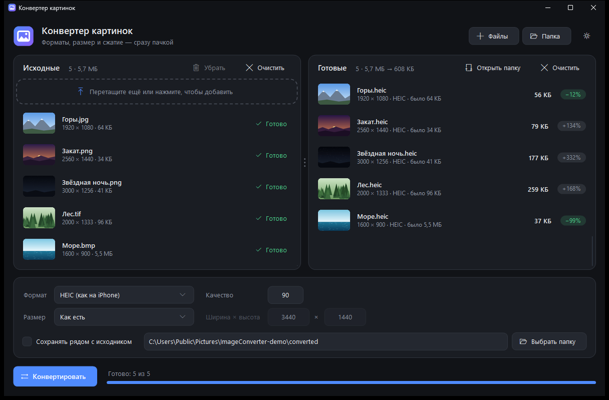
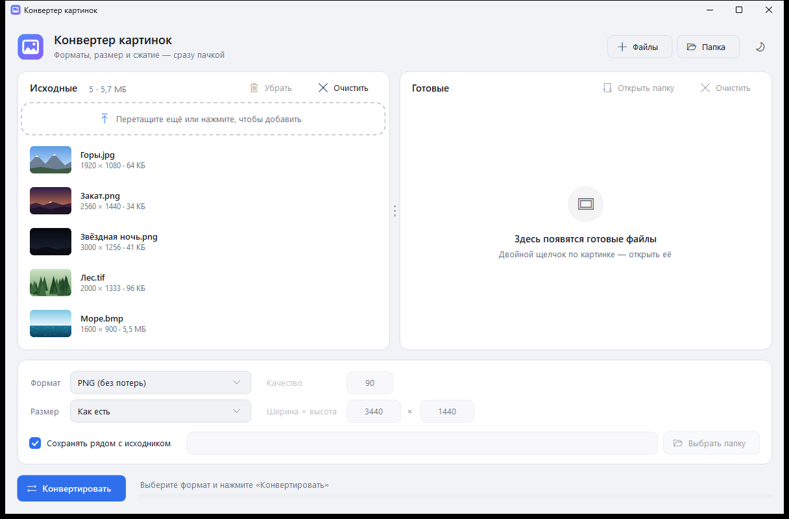

# Конвертер картинок

Небольшая программа для Windows: перетаскиваете картинки — получаете их в нужном формате и размере, сразу пачкой. Слева исходные файлы, справа готовые с новым весом и тем, насколько он изменился.



<details>
<summary>Светлая тема</summary>



</details>

## Возможности

- **Открывает:** JPG, PNG, WebP, HEIC/HEIF, AVIF, JPEG XL, RAW с фотоаппаратов (CR2, CR3, NEF, ARW, DNG и др.), BMP, GIF, TIFF, ICO, DDS
- **Сохраняет:** PNG, JPG, HEIC, JPEG XR, BMP, TIFF, GIF (для JPG, HEIC и JPEG XR — регулировка качества)
- **Размер:** как есть, заполнить с обрезкой, вписать с полями или растянуть — например, под ультраширокий монитор 3440×1440
- Файлы и целые папки (со вложенными) перетаскиваются прямо в окно
- Миниатюры, разрешение и вес до/после для каждого файла
- Поворачивает фото с телефона по EXIF
- Ничего не перезаписывает: если имя занято, добавит «(2)»
- Тёмная и светлая тема
- Один маленький `.exe` (~100 КБ), установка не нужна

## Требования

Windows 10/11. Всё нужное уже есть в системе (.NET Framework 4.8).

Какие форматы открываются, зависит от установленных в Windows расширений. Если файл не открывается, поставьте бесплатные расширения из Microsoft Store:

- HEIC — «Расширения для изображений HEIF» (и «Расширения для видео HEVC»)
- AVIF — «Расширение видео AV1»
- WebP — «Расширение для изображений WebP»
- RAW — «Расширение для необработанных изображений»

## Сборка

Ничего устанавливать не нужно — компилятор C# входит в Windows:

```bat
build.bat
```

Готовая программа появится в `bin\ImageConverter.exe`.

## Сохранение в WebP, AVIF и JPEG XL

Встроенных кодировщиков этих форматов в Windows нет. Если положить в папку `tools` рядом с программой официальные утилиты, форматы сами появятся в списке:

| Формат | Файл | Откуда |
|---|---|---|
| WebP | `cwebp.exe` | [libwebp](https://developers.google.com/speed/webp/download) |
| AVIF | `avifenc.exe` | [libavif](https://github.com/AOMediaCodec/libavif/releases) |
| JPEG XL | `cjxl.exe` | [libjxl](https://github.com/libjxl/libjxl/releases) |

## Командная строка

```bat
ImageConverter.exe --cli "вход.jpg" "выход.heic" [ШxВ] [fill|fit|stretch] [качество]
```

Например: `ImageConverter.exe --cli photo.png wallpaper.jpg 3440x1440 fill 92`

## Лицензия

[MIT](LICENSE)
